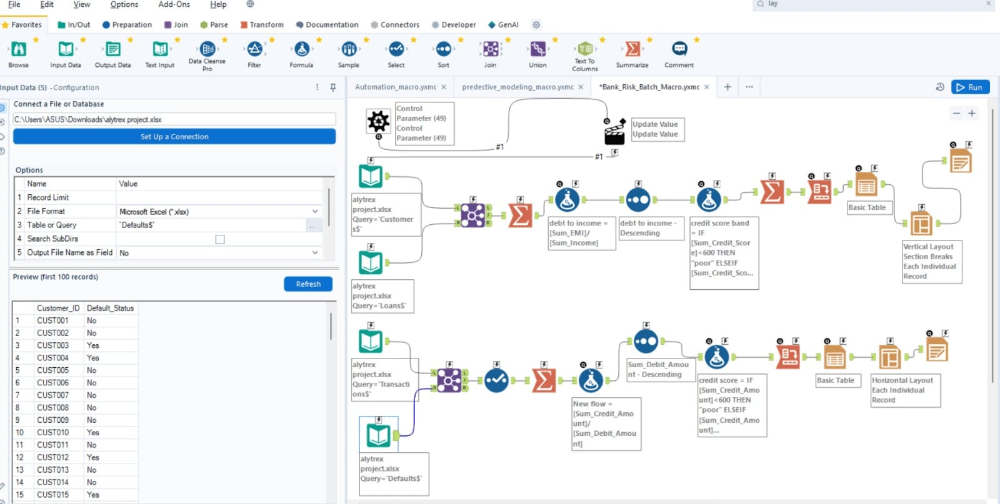

# alteryx-customer-segmentation
# Alteryx Customer Segmentation & Bank Risk Automation Project

## 📊 Project Overview
This project demonstrates an end-to-end data analytics workflow built using Alteryx Designer. 
The objective was to clean, transform, and analyze banking customer data to perform segmentation, 
risk classification, and automated reporting.

---

## 🔍 Workflow Overview

--

## 🔧 Tools & Technologies Used
- Alteryx Designer
- Batch Macro (.yxmc)
- Data Cleansing Tool
- Join Tool
- Formula Tool
- Summarize Tool
- Filter Tool
- Sort Tool
- Reporting Tools (Basic Table, Layout)

---

## 🚀 Key Features

### Customer Segmentation
- Calculated Debt-to-Income Ratio
- Classified customers based on Credit Score Band
- Identified High-risk and Low-risk customers
- Generated structured reporting output

### Bank Risk Batch Macro Automation
- Developed reusable Batch Macro
- Automated risk processing for multiple input files
- Reduced manual effort through workflow automation
- Standardized output format

---

## 📈 Business Impact
- Improved risk identification efficiency
- Automated repetitive processing tasks
- Enabled data-driven decision making
- Created scalable analytical workflow

---

## 👨‍💻 Author
Shantaram K Shingargaonkar  
Aspiring Data Analyst | Alteryx | Power BI | SQL
End-to-end data cleaning, transformation and analytics project built using Alteryx Designer with workflow automation and reporting.
